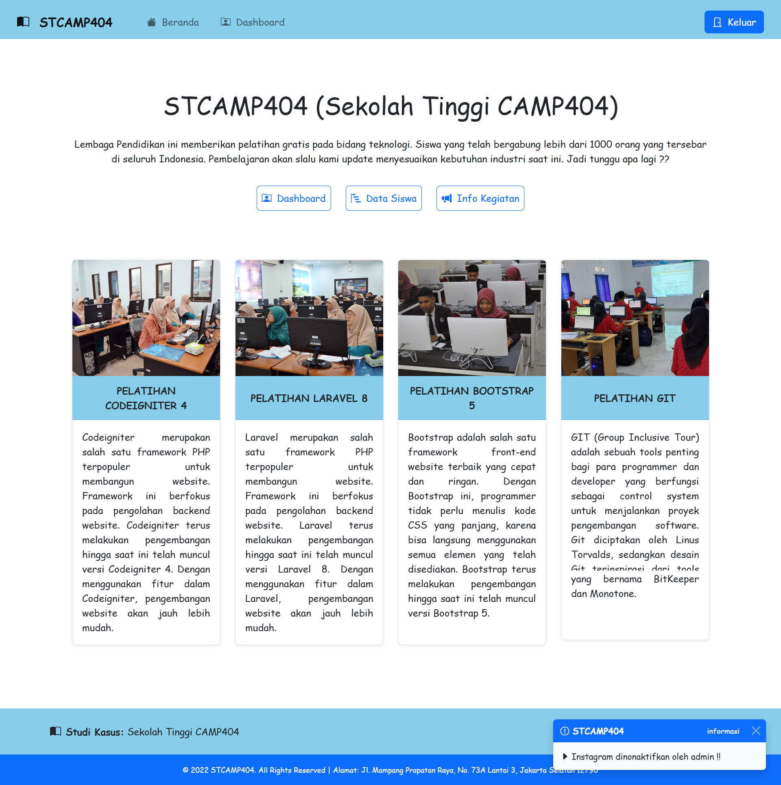
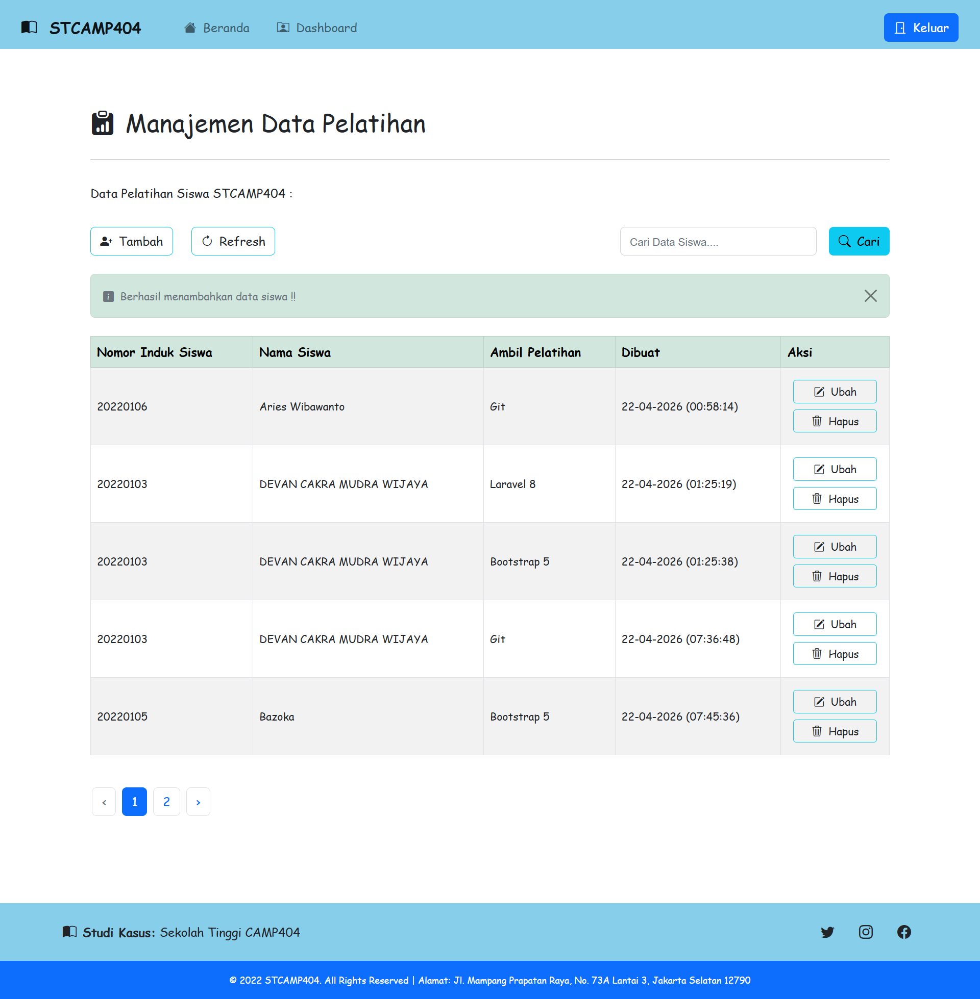
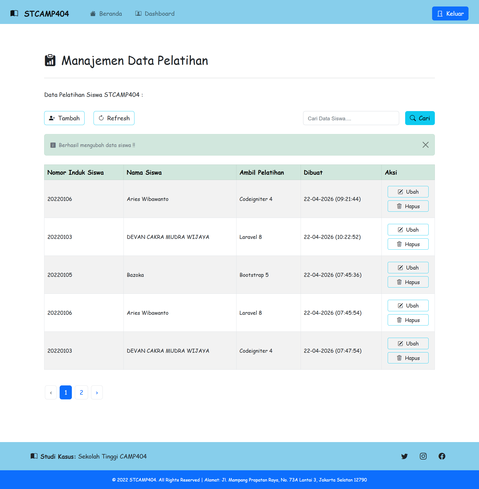
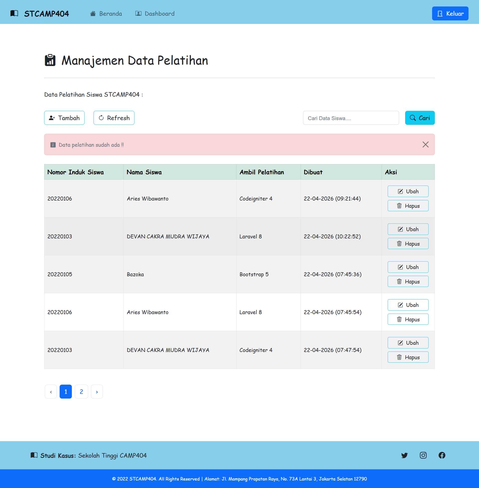

[](https://github.com/ellerbrock/open-source-badges/)
[](https://opensource.org/licenses/MIT)


# STCAMP404
<p>STCAMP404 adalah hasil pengembangan dari pelatihan reguler CAMP404 Batch 15.</p>

<br><br>

## Kebutuhan Proyek
| Bagian | Deskripsi |
| --- | --- |
| Fitur | • Masuk<br>• Buat<br>• Baca<br>• Ubah<br>• Hapus<br>• Validasi<br>• Paginasi<br>• Pencarian<br>• Grafik<br>• Hak akses<br>• DLL |
| Pustaka | Highcharts.js |
| Kerangka Kerja | • Laravel 8<br>• Bootstrap 5 |
| Peralatan | • Visual Studio Code<br>• Xampp<br>• Git |

<br><br>

## Unduh & Instal
1. XAMPP dengan PHP versi 7.4

   <table><tr><td width="810">

   ```
   https://bit.ly/XAMPP_PHP7_Installer
   ```

   </td></tr></table><br>

2. Visual Studio Code

   <table><tr><td width="810">

   ```
   https://bit.ly/VScode_Installer
   ```

   </td></tr></table><br>

3. Git

   <table><tr><td width="810">

   ```
   https://bit.ly/GIT_Installer
   ```

   </td></tr></table>

<br><br>

## Basis data
1. Buka ``` XAMPP ```, lalu tekan tombol mulai di bagian ``` Apache ``` & ``` MySQL ``` untuk menjalankan server web dan server database secara lokal.<br><br>

2. Akses peramban terlebih dahulu untuk membuka panel admin basis data, silakan salin tautan berikut: ``` localhost/phpmyadmin/ ```.<br><br>

3. Buat basis data bernama ``` stcamp404 ```.<br><br>

4. Buka basis data ``` stcamp404 ``` dan Impor ``` stcamp404_db.sql ``` di direktori ``` STCAMP404/public/sql ```.<br><br>

5. Kemudian buka berkas XAMP: ``` php.ini ``` -> hapus ``` titik koma (;) ``` di depan ``` extension=intl ``` -> simpan.

<br><br>

## Akun Bawaan
| Peran | Surel | Nama Lengkap | Kata Sandi |
| --- | --- | --- | --- |
| Admin | admin@stcamp404.ac.id | Anastasya Geralda | 123456 |
| Siswa | 20220101@stcamp404.ac.id | Jaya Mangunati | 123456 |
| Siswa | 20220102@stcamp404.ac.id | Jadiyan Marto | 123456 |

<br><br>

## Memulai
1. Pertama, silakan cloning proyek github ``` STCAMP404 ``` dan simpan di mana saja di komputer Anda dengan mengetikkan perintah berikut di ```Git Bash``` atau ```Terminal```:<br>
   <table><tr><td width="780">

   ````bash
    git clone https://github.com/cakraawijaya/STCAMP404.git
   ````

   </td></tr></table><br>

2. Ketikkan perintah berikut di ``` Git Bash ``` agar menginstall semua dependency / library yang dibutuhkan oleh project Laravel:<br>
   <table><tr><td width="780">

   ````bash
    composer install
   ````

   </td></tr></table><br>

3. Ketikkan perintah berikut di ``` Git Bash ``` agar menyalin file konfigurasi environment sebagai ``` file utama (.env) ```:<br>
   <table><tr><td width="780">

   ````bash
    cp .env.example .env
   ````

   </td></tr></table><br>

4. Buka file ``` .env ```, lalu atur isinya seperti ini:<br>
   <ul>
       <li>APP_NAME=STCAMP404</li>
       <li>DB_DATABASE=stcamp404</li>
   </ul><br>

5. Ketikkan perintah berikut di ``` Git Bash ``` agar menghasilkan application key untuk keamanan Laravel:<br>
   <table><tr><td width="780">

   ````bash
    php artisan key:generate
   ````

   </td></tr></table><br>

6. Ketikkan perintah berikut di ``` Git Bash ``` agar membuat tabel-tabel database sesuai struktur yang ada di project:<br>
   <table><tr><td width="780">

   ````bash
    php artisan migrate
   ````

   </td></tr></table><br>

7. Ketikkan perintah berikut di ``` Git Bash ``` agar menjalankan server lokal Laravel:<br>
   <table><tr><td width="780">

   ````bash
    php artisan serve
   ````

   </td></tr></table><br>

8. Buka ``` peramban ``` anda, lalu ketik -> ``` http://127.0.0.1:8000/ ``` atau sesuaikan dengan yang ada di ``` Git Bash ``` anda.<br><br>

9. Silakan masuk dan akses fitur-fiturnya, selamat menikmati [Selesai].

<br><br>

## Sorotan
<table>
<tr>
<th width="840">Beranda</th>
</tr>
<tr>
<td></td>
</tr>
</table><br>
<table>
<tr>
<th width="840" colspan="4">Manajemen Data Pelatihan</th>
</tr>
<tr>
<td width="210"></td>
<td width="210"></td>
<td width="210"></td>
<td width="210"></td>
</tr>
</table>

<br><br>

## Pengingat
<p>Jika penambahan otomatis basis data masih belum beres, maka anda dapat melakukan hal berikut ini di phpMyAdmin:</p>

<table><tr><td width="840">

```sql
SET  @num := 0;
UPDATE your_table SET id = @num := (@num+1);
ALTER TABLE your_table AUTO_INCREMENT =1;
```

</td></tr></table>

<br><br>

## Apresiasi
Jika karya ini bermanfaat bagi anda, maka dukunglah karya ini sebagai bentuk apresiasi kepada penulis dengan mengklik tombol ``` ⭐Bintang ``` di bagian atas repositori.

<br><br>

## Penafian
Aplikasi ini merupakan hasil karya saya sendiri dan bukan merupakan hasil plagiat dari penelitian atau karya orang lain, kecuali yang berkaitan dengan layanan pihak ketiga yang meliputi: pustaka, kerangka kerja, dan lain sebagainya.

<br><br>

## LISENSI 
LISENSI MIT - Hak Cipta © 2020 - Devan C. M. Wijaya

Dengan ini diberikan izin tanpa biaya kepada siapa pun yang mendapatkan salinan perangkat lunak ini dan file dokumentasi terkait perangkat lunak untuk menggunakannya tanpa batasan, termasuk namun tidak terbatas pada hak untuk menggunakan, menyalin, memodifikasi, menggabungkan, mempublikasikan, mendistribusikan, mensublisensikan, dan/atau menjual salinan Perangkat Lunak ini, dan mengizinkan orang yang menerima Perangkat Lunak ini untuk dilengkapi dengan persyaratan berikut:

Pemberitahuan hak cipta di atas dan pemberitahuan izin ini harus menyertai semua salinan atau bagian penting dari Perangkat Lunak.

DALAM HAL APAPUN, PENULIS ATAU PEMEGANG HAK CIPTA DI SINI TETAP MEMILIKI HAK KEPEMILIKAN PENUH. PERANGKAT LUNAK INI DISEDIAKAN SEBAGAIMANA ADANYA, TANPA JAMINAN APAPUN, BAIK TERSURAT MAUPUN TERSIRAT, OLEH KARENA ITU JIKA TERJADI KERUSAKAN, KEHILANGAN, ATAU LAINNYA YANG TIMBUL DARI PENGGUNAAN ATAU URUSAN LAIN DALAM PERANGKAT LUNAK INI, PENULIS ATAU PEMEGANG HAK CIPTA TIDAK BERTANGGUNG JAWAB, KARENA PENGGUNAAN PERANGKAT LUNAK INI TIDAK DIPAKSAKAN SAMA SEKALI, SEHINGGA RISIKO ADALAH MILIK ANDA SENDIRI.